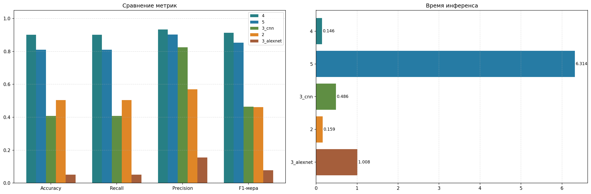
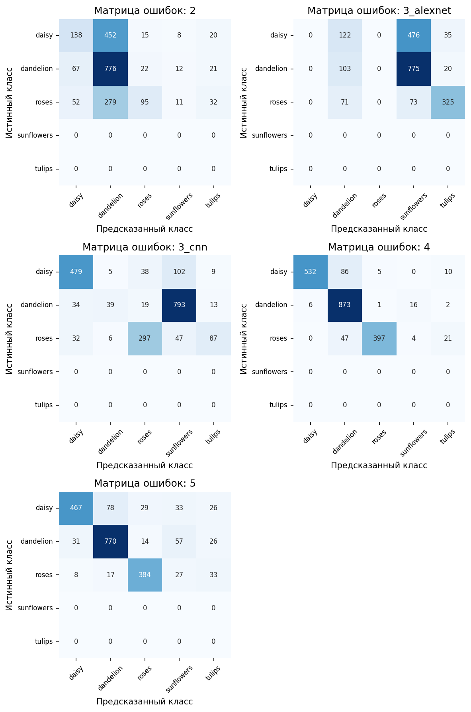

# Flower Classification Project

Проект реализует классификацию изображений цветов с помощью моделей глубокого обучения, а также предоставляет API и веб-интерфейс для взаимодействия с лучшей моделью, выявленной после сравнения результатов работ 2-5. В датасете используются 5 классов: daisy, dandelion, roses, sunflowers, tulips. Всего изображений: 3670.

## Описание датасета

В проекте использовался датасет с изображениями цветов по 5 категориям: ромашки (daisy), одуванчики (dandelion), розы (roses), подсолнухи (sunflowers) и тюльпаны (tulips). Эти классы использовались в обучении и в итоговой задаче многоклассовой классификации изображений.

| Модель    | Размер входа | Accuracy | Recall | Precision | F1-мера | Инференс (мс/изобр) |
|-----------|--------------|----------|--------|-----------|---------|---------------------|
| 4         | 32×32        | 0.9010   | 0.9010 | 0.9336    | 0.9128  | 0.159               |
| 5         | 224×224      | 0.8105   | 0.8105 | 0.9027    | 0.8527  | 6.396               |
| 3_cnn     | 128×128      | 0.4075   | 0.4075 | 0.8251    | 0.4636  | 0.187               |
| 2         | 64×64        | 0.5045   | 0.5045 | 0.5699    | 0.4620  | 0.104               |
| 3_alexnet | 128×128      | 0.0515   | 0.0515 | 0.1562    | 0.0775  | 1.048               |  |







## Локальный запуск

#### 1. Клонирование репозитория

```bash
git clone https://github.com/USERNAME/flower-classification-project.git
cd flower-classification-project
```
#### 2. Установка зависимостей

```bash
pip install -r requirements.txt
```
#### 3. Запуск API

```bash
cd api
pip install -r requirements.txt
uvicorn main:app --reload
```
После запуска API обычно доступен по адресу:
```text
http://127.0.0.1:8000
```
#### 4. Запуск Streamlit-интерфейса

```bash
cd streamlit_app
pip install -r requirements.txt
streamlit run app.py
```
#### После запуска интерфейс обычно доступен по адресу:

```text
http://localhost:8501
```
### Пример использования API

Пример POST-запроса через curl:
```bash
curl -X POST "https://dpo-classification.onrender.com/predict" \
  -F "file=@example.jpg"
```
Пример ожидаемого JSON-ответа:
```json
{
  "predicted_class": "roses",
  "predicted_index": 2,
  "confidence": 0.91,
  "probabilities": {
    "daisy": 0.02,
    "dandelion": 0.01,
    "roses": 0.91,
    "sunflowers": 0.04,
    "tulips": 0.02
  }
}
```

API: 
```
https://rsbtv-flowers-api-backend.hf.space/predict
```

Streamlit-приложение:
```
https://flowersapp-4urhpz4rfymynfxy9dglgd.streamlit.app
```

Используемые технологии
```
Python
TensorFlow / Keras
FastAPI
Streamlit
Pandas / NumPy / Matplotlib
```

